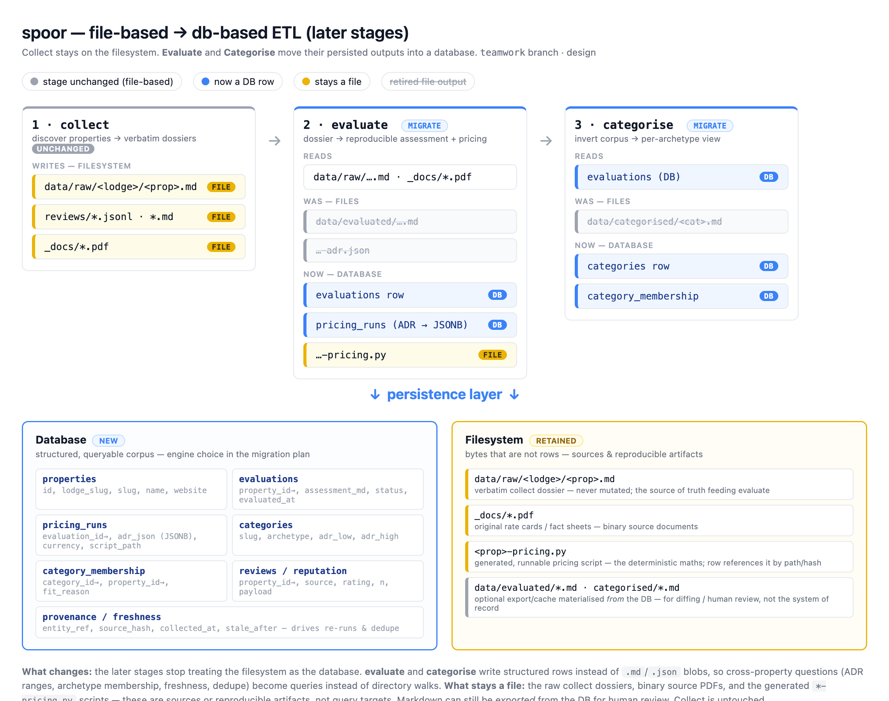

# Moving the Later Pipeline Stages from Files to a Database

A design overview for taking the **evaluate** and **categorise** stages of `spoor`
off the filesystem and into a database. Lives on the `teamwork` branch.

> **Status:** designed, and proven end-to-end with a working **prototype** on this branch
> (`spike_db/`, see [Prototype](#prototype)). The live pipeline is **not yet migrated** — it
> still writes files; the prototype ran against an imported copy of the data. This doc
> describes the intended production shape, not the current one.

## Table of Contents

- [Origin](#origin)
- [The idea](#the-idea)
- [Architecture at a glance](#architecture-at-a-glance)
- [What moves, what stays](#what-moves-what-stays)
- [Why a database](#why-a-database)
- [Database choice: Postgres](#database-choice-postgres)
- [The data model](#the-data-model)
- [How the stages change](#how-the-stages-change)
- [Getting the existing data in](#getting-the-existing-data-in)
- [Rollout](#rollout)
- [Open questions](#open-questions)
- [Prototype](#prototype)
- [Related: Firecrawl review scraper](#related-firecrawl-review-scraper)

## Origin

This started at a whiteboard. Three items: **File → DB**, **Firecrawl?**, and a
**CLAUDE.md** for the repo. This doc covers the first.

## The idea

`spoor` runs a three-stage pipeline — **Collect → Evaluate → Categorise** — and today
every stage persists to the filesystem under `data/`. That is fine for *producing* one
property at a time, but wrong for *asking questions across* properties, which is what
the later stages increasingly need to do.

The plan: move the **later stages** — evaluate and categorise, and the data they
persist — into a database. **Collect is untouched**; its raw dossiers, review files,
and source PDFs stay on disk and remain the source of truth.

A few terms used throughout:

- **Average daily rate** — the per-night room rate (rate + mandatory per-person levies,
  divided by nights). The pipeline computes it per property and per traveller archetype.
- **Evaluation** — the middle stage's output for one property: a structured, reproducible
  assessment plus the numbers behind it.
- **Category** — one of the fourteen fixed traveller archetypes (honeymoon couple,
  multi-generation family, and so on) that the corpus is inverted into.

## Architecture at a glance

Collect keeps writing files. Evaluate and categorise stop treating the filesystem as the
database: they write rows. The questions that are awkward today — "every property under a
given price for a couple", "which archetype does this property belong to", "is this
evaluation stale" — become ordinary queries rather than directory walks.

## What moves, what stays

The boundary is deliberate. The migration stops at the *input edge* of evaluate, so
collect can keep evolving independently.

- **Becomes rows:** the per-property evaluation, and the category-to-property
  relationships that categorise produces.
- **Stays a file:** the raw dossiers and review files (collect's output); the original
  rate-card PDFs; and the generated `*-pricing.py` script for each property. The pricing
  script stays a file because it is a real, runnable, golden-tested artifact — the tests
  load it and assert exact prices, and that gate must not move.
- **Not persisted at all:** pricing runs. Driving a pricing script across the benchmark is
  cheap, so categorise recomputes it on demand rather than storing it.

## Why a database

The file model is fine for writing one property; it fights you when you read across them.

- **Cross-property questions mean re-parsing the whole corpus.** Categorise re-reads every
  evaluation and re-runs every pricing script on each run. "Show me everything under a
  price for a couple" is a script, not a query.
- **There is no clean way to update in place.** A property's identity is encoded in a file
  path, so re-running overwrites sibling files and hopes the name matched. A row can be
  updated atomically, keyed on stable identity.
- **Provenance is scattered.** When something was evaluated, against which rate-card
  version, by which model — that lives across file headers and embedded fields, if at all.
  Columns make it first-class.
- **Categorise cannot rerun on its own.** It depends on the evaluate output existing as
  files. Persisting evaluations means categorise can run independently off the database —
  the main reason the evaluation stage is kept in the model at all.

## Database choice: Postgres

**Postgres.** It is the house database — Magic Lake already runs it (see that repo's
`deploy/docker/` and `docs/infrastructure/database.md`), so the tooling, the local
container pattern, and the team's familiarity all carry straight over. It handles the
JSON payloads (the evaluation blob), the relational joins (category-to-property), and any
future concurrency without a second thought. We run it locally in a container.

## The data model

Four ideas, kept small and readable:

- **properties** — the anchor. One row per bookable camp, identified by its lodge and
  property names.
- **evaluations** — the middle-stage output, one row per property, carrying the full
  assessment payload. This is what lets categorise run off the database.
- **categories** — the fourteen fixed archetypes (the taxonomy lives in
  `spoor/categories.py` and is mirrored into the table).
- **category_membership** — the relationship that matters most: which properties belong to
  which category, with the price range and feasibility that justify it. It is modelled to
  be read directly — a single readable listing answers "what is in this category and why".

The authoritative schema (the actual table definitions) lives with the prototype, in
`spike_db/schema.sql` on the `spike/postgres-db` branch, alongside a drawn
entity-relationship diagram. Pricing is deliberately absent from the schema — it is
recomputed, not stored.

## How the stages change

The principle the project rests on does not move: **the skill does the thinking, the
tested core does the maths.** Only the final step of each deterministic stage changes from
"write a file" to "write a row".

- **Evaluate** computes the same numbers it does today, then persists the evaluation as a
  row instead of three files.
- **Categorise** reads its corpus from the database instead of walking `data/evaluated/`,
  recomputes each property's price range for a category's party, and writes the
  category-to-property rows.
- The deterministic modules (`spoor/benchmark.py`, `spoor/categories.py`, and friends) keep
  their logic; they gain a persistence layer to call instead of writing files.

## Getting the existing data in

A one-time import walks the current `data/evaluated/` tree and loads each property and its
evaluation into the database; the category relationships are produced by running categorise
against that imported corpus. The committed files can stay as a human-readable export that
is regenerated from the database — so git diffs and review still work — while the database
is the thing the pipeline reads and writes.

## Rollout

Staged so the test suite stays green throughout. Surface area, not time:

1. **Persistence layer + round-trip.** Add the schema and an import/export that can load
   the file corpus into the database and write it back unchanged. Nothing reads the
   database yet.
2. **Write to both.** The stages write the file *and* the row, so the two can be compared.
3. **Read from the database.** Categorise sources its corpus from the database; the price
   goldens still load the committed pricing scripts by path.
4. **Database is canonical, files become an export.** The pricing scripts and the frozen
   test dossiers stay real files permanently.

## Open questions

- **Do the committed `data/evaluated/` and `data/categorised/` files stay long-term as a
  regenerated export, or are they dropped once the database is canonical?** Keeping them
  preserves line-level diffs and the two-checkout reality across machines.
- **How far up does the database go?** This design stops at the evaluate input edge.
  Pulling collect (dossiers, reviews) in later is a larger change and is deferred.

## Prototype

A throwaway prototype on the **`spike/postgres-db`** branch validated this end-to-end: a
persistent Postgres container, the schema above, the existing file corpus imported, and
categorise run entirely off the database with unit tests passing. Its write-up, schema, and
entity-relationship diagram live under `spike_db/` on that branch. The prototype is for
learning whether the shape works — not the implementation we ship.

## Related: Firecrawl review scraper

The whiteboard's second item asked whether the Firecrawl-based TripAdvisor review scraper
actually works. It does: a live fetch returned a full page of correctly-parsed reviews and
the unit tests pass. A handful of robustness issues are worth hardening before relying on
it heavily — an unstable de-duplication key and no partial save if a page fetch fails
mid-run among them. The scraper lives in `.claude/skills/collect/scripts/`.
