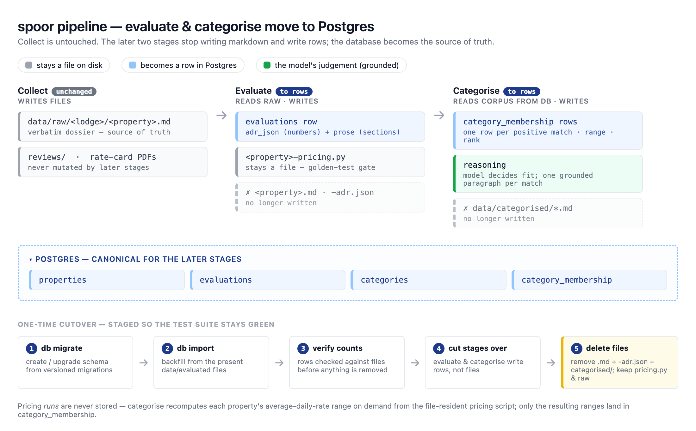
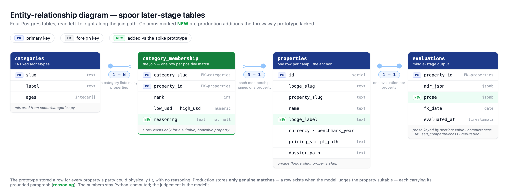

# PRD — File-to-database migration (evaluate + categorise)

## Problem Statement

`spoor` runs a three-stage pipeline — Collect → Evaluate → Categorise — and today every
stage persists to the filesystem under `data/`. That is fine for *producing* one property at
a time, but wrong for *asking questions across* properties, which is what the later stages
increasingly need to do. The design behind this change is set out in
[docs/db-migration/README.md](../docs/db-migration/README.md); this product requirements
document is the build.

The file model fights us in three concrete ways:

- **Cross-property questions mean re-parsing the whole corpus.** Categorise re-reads every
  evaluation and re-runs every pricing script on each run. "Show me everything under a price
  for a couple" is a script, not a query.
- **There is no clean way to update in place.** A property's identity is encoded in a file
  path, so re-running overwrites sibling files and hopes the name matched. A row can be
  updated atomically, keyed on stable identity.
- **Categorise cannot rerun on its own.** It depends on the evaluate output existing as
  files. Persisting evaluations lets categorise run independently off the database.

We are moving the **later** stages — evaluate and categorise, and the data they persist —
into **Postgres**, the house database. **Collect is untouched**: its raw dossiers, review
files, and source rate-card PDFs stay on disk and remain the source of truth.

A throwaway prototype validated the shape end-to-end, but it deliberately cut a corner that
this build must restore: it decided category membership on **capacity alone** (does the party
physically fit) and stored neither the model's **suitability judgement** nor the **grounded
paragraph** that justifies it. Those are the heart of what categorise does.

> **Average daily rate** is the per-night room rate (rate plus mandatory per-person levies,
> divided by nights), reported on a published-rack basis. It is computed per property and per
> traveller archetype, always by tested Python — never hand-assembled by the model.

## Solution

Build a persistence layer in the `spoor` package on the **house database stack** — SQLModel
models, Alembic migrations, and the psycopg2 driver — and cut the two later stages over so the
**database is canonical**:

- **Evaluate** writes one `evaluations` row per property — both the numeric average-daily-rate
  payload (as queryable JSON) and its grounded prose (as JSON keyed by section) — and stops
  writing the `<property>.md` and `<property>-adr.json` files. It still writes the generated
  `<property>-pricing.py` script to disk.
- **Categorise** reads its corpus from the database (not by walking `data/evaluated/`),
  recomputes each property's average-daily-rate range for a category's party, and writes
  `category_membership` rows instead of `data/categorised/*.md`.

The project's central discipline is preserved: **the tested core does the maths, the model
does the thinking.** The numbers in a membership row are computed by Python; the model only
decides whether a property *suits* an archetype and writes the one-paragraph justification.
The two are joined at write time by a single command that recomputes the numbers, merges the
model's judgement, and rewrites a whole category in one atomic transaction — so a rerun can
never leave numbers and judgement out of step.

The cutover is staged so the test suite stays green throughout: build the persistence layer,
import the existing file corpus, cut the stages over, then delete the superseded files. The
`*-pricing.py` scripts (the golden-test gate) and the `data/raw/` tree stay on disk
permanently.

Concretely, the operator runs:

- `spoor db migrate` — create or upgrade the schema.
- `spoor db import` — one-time backfill of the present `data/evaluated/` tree into the
  database.
- `spoor evaluate "<lodge>"` — as today, but persists rows instead of the markdown / JSON
  files.
- `spoor categorise` — as today, but persists membership rows instead of markdown.

*The pipeline after the migration, and the one-time cutover. Collect is untouched; the later two stages write rows. The pricing scripts and the raw tree stay on disk.*

## User Stories

**Persistence layer and schema**

1. As a developer, I want the database layer built with **SQLModel** — one class per table
   that is both the SQLAlchemy table and its schema — with the query/write helpers kept in a
   thin store module rather than on the models, so that the data definitions stay clean and
   every SQL-shaped operation lives in one place.
2. As a developer, I want the database stack (SQLModel, SQLAlchemy, Alembic, and the
   **psycopg2** driver) declared as an **optional** `db` extra and imported only inside
   `spoor/models/` and `spoor/db/`, so that the deterministic core (`spoor/benchmark.py`,
   `spoor/categories.py`, the generated pricing scripts) stays stdlib-only and importable
   without it.
3. As a developer, I want the connection string read from a `DATABASE_URL` environment
   variable with a sensible local default that matches the local container, so that the same
   code runs against local, test, and production unchanged and no configuration file is
   required to get started.
4. As an operator, I want a `docker-compose.yml` at the repository root that runs Postgres
   locally on a non-default port (5433), so that it does not clash with the house Postgres on
   5432.
5. As a developer, I want the schema defined as **Alembic migrations** under
   `spoor/db/alembic/versions/`, committed to the repository and tracked by Alembic's version
   table, so that the schema evolves without dropping data and a fresh database and an existing
   one converge to the same shape. Every migration is reviewed before it is applied and never
   edited once applied.
6. As an operator, I want a `spoor db migrate` command that applies all pending migrations
   (`alembic upgrade head`) and is safe to run repeatedly, so that bringing a database up to
   date is one idempotent step.

**Data model**

7. As an analyst, I want a `properties` row per bookable camp keyed on `(lodge_slug,
   property_slug)`, so that re-running a stage updates a property in place rather than
   overwriting sibling files.
8. As an analyst, I want each property to carry its **lodge-group display label** (for
   example "Londolozi", "Tanda Tula"), populated from the raw dossier's `Lodge group` line,
   so that the label the categorised view needs is first-class rather than re-derived — the
   `adr.json` never recorded it.
9. As an analyst, I want one `evaluations` row per property holding the numeric
   average-daily-rate payload as queryable `JSONB`, so that the figures behind an evaluation
   are stored once and can be filtered in SQL.
10. As an analyst, I want the evaluation's grounded prose stored as `JSONB` keyed by section
    (value, completeness, fit, self-competitiveness, and reputation when reviews exist), so
    that categorise can read the suitability evidence off the database and optional sections
    need no schema change.
11. As an analyst, I want the fourteen fixed traveller archetypes mirrored into a `categories`
    table from `spoor/categories.py`, so that the taxonomy has one authoritative source and
    the relationship table can reference it.
12. As an analyst, I want a `category_membership` row **only for properties that genuinely
    suit a category**, carrying the deterministic numbers (average-daily-rate range and rank)
    and the grounded `reasoning` paragraph, so that a category lists exactly the properties I
    would actually consider — nothing more.
13. As an analyst, I want a property included **only when it both fits the party and the
    evaluation supports the archetype**, with excluded properties leaving **no row** at all,
    so that membership stays positives-only — no `suitable` flag, no `included` column, and no
    stored feasibility count to maintain. An exclusion is still derivable when needed: it is
    any evaluated property absent from a category.
14. As an analyst, I want a readable listing view joining category to property with the
    justifying numbers and the reasoning, so that "what is in this category and why" is a
    single query.

**Evaluate cutover**

15. As a developer, I want the evaluate skill to emit its prose as structured sections
    (rather than free markdown that something must parse), so that the sections land in the
    database verbatim and no brittle heading-parser is introduced.
16. As an operator, I want `spoor evaluate` to upsert the property (including the lodge label)
    and write the evaluation row, and to **stop** writing `<property>.md` and
    `<property>-adr.json`, so that the database becomes the canonical evaluate output.
17. As an operator, I want `spoor evaluate` to keep writing the `<property>-pricing.py` script
    to disk, so that the golden price tests continue to load it by path and the acceptance
    gate does not move.

**Categorise cutover**

18. As a developer, I want categorise to source its corpus from the database instead of
    globbing `data/evaluated/`, with the database read living in the persistence layer and
    `spoor/categories.py` keeping its pure, stdlib-only maths (one copy of the pricing loop in
    `category_ranges`), so that categorise can run independently off the database without the
    deterministic core taking a database dependency.
19. As an operator, I want categorise to compute every candidate's average-daily-rate range
    deterministically, then have the model decide suitability and write one grounded
    paragraph per fitting property, so that the numbers stay tested-Python and the judgement
    stays the model's — exactly as the two-file version split them.
20. As an operator, I want a single `spoor categorise persist --category <slug>` command that
    takes the model's per-property judgement, recomputes the numbers, merges them, and
    rewrites the whole category in one atomic transaction, so that a rerun cannot leave
    numbers and judgement out of step and the model never authors a number.
21. As an operator, I want `spoor categorise` to **stop** writing `data/categorised/*.md`, so
    that membership lives only in the database.
22. As an analyst, I want grounding for the reasoning paragraph to come only from the
    evaluation stored in the database (its prose sections and numeric payload), so that
    categorise never re-derives facts from `data/raw/`.

**Cutover and migration of existing data**

23. As an operator, I want a `spoor db import` command that walks the present
    `data/evaluated/` tree and loads each property and its evaluation into the database, so
    that the existing corpus is preserved without re-running evaluate.
24. As an operator, I want the import to report row counts I can check against the files
    before anything is deleted, so that the cutover is verifiable.
25. As an operator, I want the superseded files — the evaluation markdown, the `adr.json`
    files, and all of `data/categorised/` — deleted only **after** a verified import, so that
    nothing is lost in the move.

**Command-line surface and documentation**

26. As a developer, I want the new `db migrate`, `db import`, and `categorise persist`
    subcommands added to `spoor/cli.py`, and the evaluate / categorise subcommands updated,
    so that the command line and the skills stay in lockstep (the project rule).
27. As a developer, I want `CLAUDE.md`, `README.md`, the migration design doc, and the skills
    table updated to describe the database-backed stages, so that the canonical docs match the
    pipeline.

## Implementation Decisions

**The persistence stack**
- The layer follows the house pattern (the same one Magic Lake uses): **SQLModel** for the
  models — each table is one class that is both the SQLAlchemy table and its schema, with the
  option to drop to raw SQLAlchemy any time — **Alembic** for migrations, and
  **psycopg2-binary** as the driver. All three, with SQLAlchemy, are the optional `db` extra.
- The models live in `spoor/models/` (with `__init__.py` importing **every** model class so
  Alembic autogenerate and `create_all()` see them); the engine, session factory, store
  helpers, and importer live in `spoor/db/`. The deterministic core never imports any of it,
  so `spoor collect` and the stdlib-only tests run on a plain install.
- The engine is created once from `DATABASE_URL` with `pool_pre_ping=True` (silently
  reconnects dropped connections) and an optional `DB_ECHO` for statement logging; the local
  default matches the `docker-compose` container on port 5433. Query/write helpers stay in a
  thin store module, not on the models.
- A throwaway prototype validated the end-to-end shape; this build promotes that shape — the
  table design, the importer logic, and a persistent local container — onto this stack. The
  schema is reborn as Alembic migrations and the tests are rewritten.

**Schema (as Alembic migrations under `spoor/db/alembic/versions/`)**
- Four tables — `properties`, `evaluations`, `categories`, `category_membership` — defined as
  SQLModel classes, plus a readable listing view. Semi-structured payloads use Postgres
  **`JSONB`** (queryable with `->`, `->>`, `@>`), not plain JSON: `evaluations` carries the
  numeric average-daily-rate payload and the grounded `prose` (keyed by section) as `JSONB`.
  Production shape: `properties.lodge_label`; `evaluations.prose` alongside the numeric
  payload; and on `category_membership` the grounded `reasoning` paragraph (`NOT NULL`).
  Membership is **positives-only**: a row exists for a property only when the model judges it
  suitable, so there is no `suitable` flag, no `included` column, and no stored feasibility
  count — an excluded property simply leaves no row.

*The four tables, read along the join path. Green columns (`lodge_label`, `prose`, `reasoning`) are the production additions the prototype lacked.*
- The listing view is created by hand inside a migration (`op.execute("CREATE VIEW …")`)
  because Alembic autogenerate does not emit views. Every autogenerated migration is read and
  corrected before it is applied (autogenerate is a draft, not gospel), and `compare_type=True`
  is set in `env.py` so column-type changes are detected.
- Every write is an upsert keyed on stable identity. Category membership is rewritten per
  category as an atomic delete-then-insert inside one transaction, so a rerun replaces rather
  than accumulates.

**The two owners of a membership row**
- The deterministic core computes `rank` and the average-daily-rate range (driving the pricing
  script across the benchmark months — a transient feasibility check gates capacity, but the
  per-month count is not stored). The model decides which properties suit the archetype and
  writes a `reasoning` paragraph for each match. They are **joined at write time** by
  `spoor categorise persist`: the command computes the numbers for the candidates, takes the
  model's judgement document (listing only the matches and their reasoning), and writes the
  category's positive members in one transaction. The model never authors a number; a non-match
  produces no row.

**Evaluate prose**
- The evaluate skill authors its sections as structured output and the stage stores them as
  `JSONB` keyed by section. There is no markdown-heading parser. Reputation is omitted when a
  property has no reviews.

**Cutover order (so the suite stays green)**
- migrate → import → verify counts → cut evaluate and categorise over → delete the superseded
  files. The `*-pricing.py` scripts and `data/raw/` are never touched.

## Testing Decisions

**What makes a good test here:** the deterministic core keeps being tested through its public
interface with a fake `price_fn` and throwaway fixtures, with **no database and no model in
the test path** — those tests must stay green and dependency-free throughout the cutover. The
golden price tests are unchanged: they load the committed `*-pricing.py` scripts by path and
remain the acceptance gate.

**New database tests (opt-in, against a disposable Postgres):**
- They run against a throwaway Postgres spun up by **`pytest-postgresql`** on a random port
  (no Docker, no touching a real database), with per-test isolation by **SAVEPOINT rollback**
  and the suite parallelised with **`pytest-xdist`**. Most tests build the schema with
  `SQLModel.metadata.create_all()` for speed; a migration-parity test applies the full Alembic
  chain so the migrations themselves are exercised.
- Migration idempotency — applying migrations twice converges to the same schema; a fresh and
  an already-migrated database end identical.
- Property and evaluation upsert round-trip, including the `JSONB` payload and the prose
  sections.
- The atomic per-category write — a rerun **replaces** a category's membership rather than
  accumulating rows, and numbers and judgement always agree afterwards.
- Positives-only membership — a property the model judges unsuitable, and one whose party
  cannot fit, both produce **no row**; only genuine matches are stored, each with a non-null
  `reasoning`.
- The corpus read used by categorise returns exactly the imported, fully-evaluated
  properties.

The database suite is gated behind a marker (and skipped when the database libraries are
absent or no database is reachable) so a plain `pytest` run stays stdlib-only, matching the
optional-extra posture. The model-authored suitability and prose are not unit-tested,
consistent with how evaluate's prose and the `assess` pass are treated.

## Out of Scope

- **Collect.** The raw dossiers, review files, and rate-card PDFs stay on disk and remain the
  source of truth; pulling them into the database is a later, larger change.
- **Keeping the markdown as a regenerated export.** This was considered and rejected: once the
  database is canonical, the evaluation and categorised markdown are deleted, not exported.
- **Persisting pricing runs.** Driving a pricing script across the benchmark is cheap;
  categorise recomputes on demand. Only the resulting ranges are stored.
- **Moving the `*-pricing.py` scripts into the database.** They stay runnable files; the
  golden tests load them by path and that gate must not move.
- **Changing the average-daily-rate maths, the benchmark spec, or the fixed taxonomy.** This
  is a persistence change, not a logic change.
- **A managed or remote database.** Local Postgres in a container is the target; deployment is
  out of scope.
- **Unit tests for the model-authored membership and prose, and for the thin command-line
  orchestration.**

## Further Notes

- The single most important correction over the prototype is restoring the **suitability**
  judgement and its **grounded paragraph**. The prototype set `included = feasible_months > 0`
  — pure capacity — which would put a property in every category its party can physically fit,
  the opposite of the honest, evidence-based membership the categorise phase exists to
  produce. Membership stores that judgement as the presence of a row plus its `reasoning`.
- Membership is **positives-only**, matching the file-era output: a category lists only the
  properties that genuinely suit it, each with its grounded paragraph. Negative matches are
  deliberately not stored — recording *why* the model excluded a property is information we do
  not want, and "why isn't this property here?" is still answerable as its absence (any
  evaluated property with no row for that category). This drops the `suitable` flag, the
  `included` column, and the stored feasibility count the full-matrix design would have carried.
- The lodge-group label gap is a real provenance fix: the label is present in the raw dossier
  (`**Lodge group:** …`) but was never carried into `adr.json`, so the file-era categorise
  step re-derived it from prose. Carrying it onto the property row makes it first-class.
- This PRD covers the **evaluate + categorise** persistence migration only — the later half of
  the Collect → Evaluate → Categorise pipeline described in
  [architecture_decisions.md](../architecture_decisions.md).
